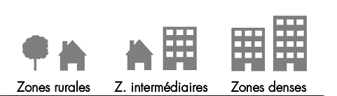

```{r setup, include=FALSE}
knitr::opts_chunk$set(echo = TRUE)
library(dplyr)
library(ggplot2)
library(ggpubr)
library(tidyr)
```

### Mobile Network QoS Data set Analysis

## Abstract 

Most of the time, people complain about different network services that doesn’t work as expected: a file that couldn’t be sent or download, a voice call where we couldn’t hear the other party well, or an SMS that took an eternity to be delivered.
The aim of this project is to allow users to compare the 2G, 3G and 4G services of four mobile operators in mainland France under the same conditions to perceive the different factors affecting the quality of mobile networks. 
Each year, Arcep regularly assesses the performance of mobile networks among its operators, and publishes them in its observatories. This initiative invites consumers to compare the quality of operators, according to their needs and for the uses that matter to them: telephony, mobile internet, in dense areas, in rural areas, on the train, on highways, etc.


## Introduction and related Work
Monitoring the performance of the mobile networks is a mandatory thing in today’s world for several reasons. On one hand, it is important to have an image of the quality of services as felt by the customer and compare it with users' perception and subscriber Satisfaction Indicators.
On the other hand, this monitoring allows operators to update their optimization plans to keep up with users habits and their needs and also to keep up with the technological advancements that we’re experiencing in this.
taking all of that in consideration the new question we going to answer by this dataset are the following :
New Questions :
* does the place where we're using our devices (inside buildings, outside buildings, train, cars ) effect  the quality of our wireless services ? 
* does the type of network used (2g ,3G) effect  the quality of our wireless services ? 
* is there a relationship between the environment ( Dense area, rural, intermediate ) and the quality of the service offered, especially (sending or uploading files ) ?
* if I want to go to a place(city or region ) what network operator should I choose to get the best service quality ? 

Cites 5 _relevant_ pieces of relevant work:

* <https://www.researchgate.net/publication/242012325_Beyond_3G_4G_Mobile_Communication>
* <http://eprints.networks.imdea.org/1464/1/Mobile_Network_Architecture_Evolution_toward_5G_2016_EN.pdf>
* <https://cordis.europa.eu/project/id/20958>
* <https://www.researchgate.net/publication/235322398_Developments_for_4G_and_European_policy>
* <https://books.google.es/books?id=MwTKAi4DvzMC&printsec=frontcover&dq=Towards+a+Global+3G+System:+Advanced+Mobile+Communications+in+Europe,+Volume+2&hl=fr&sa=X&ved=0ahUKEwjVpvOWncDmAhVBXhoKHePgAvMQ6AEIKDAA#v=onepage&q=Towards%20a%20Global%203G%20System%3A%20Advanced%20Mobile%20Communications%20in%20Europe%2C%20Volume%202&f=false>


## Exploratory Data Analysis (**20 points**)
- Introduces the dataset by describing the origin (source) and structure (shape, relevant features) of the data being used (**5 points**)


#### Data Description: 
The Dataset revolves around mobile network QoS parameters for voice calls, SMS and Internet services, provided by the French government at monreseaumobile.fr.
Qos parameters can be summarized in the following points:

1.	Area 
All locations are measured at the same time and by the same phone model for each operator. Also, to be as representative as possible, measurements are made for each service (voice / SMS and mobile internet):



* Transportation Means 
*	Dense Zones :  more than 400,000 inhabitants.
*	Intermediate zones : between 10,000 and 400,000 inhabitants.
*	Rural Zones  : more than 10 000 inhabitants.

2.	Terminal type
The measurements were carried out with consumer terminals: 
+ For the 2G / 3G profile, the Samsung S5 new and the iPhone 5S.
+ For the 2G / 3G / 4G profile, the Samsung S6 and the iPhone 6.

3.	Service 
Each service has his own QoS indicator: 
* Streaming video   ;   
* Send a file   ;   
* SMS   ;   
* Download a file    ;   
* Loading Web page  ;   
* Voice call,  

4.	Indicator 
Several indicators are related to services offered, among them we have:
* The rate of perfect voice quality communications,
* The Rate of SMS received in less than 10 seconds,
* The average speed for downloading and sending files,
* The rate of web pages loaded in less than 10 seconds,
* The rate of videos of 2 minutes duration viewed with perfect quality.
5.	usage 
* Indoor (Inside buildings)   ;  
* Outdoor (Outside Buildings)  ;   
* InCar  ;   
* Transportation Means.

6.	Operators
 * SFR    ;     
 * Bouygues Telecom    ;     
 * Orange    ;     
 * Free Mobile .

7.	Statistical precision/P-value
The results of the present investigation include a margin of error. The statistical precision indicated below each result is the interval containing the result with a probability of 95%. Any comparison between the different indicators must therefore take this confidence interval into account.

#### Data exploration and Preprocessing :

  + **loading missed libraries and opening data set: **
the first thing we did is installing and loading libraries that we are going to use in our analysis and then importing the data set into a local variable in memory.

```{r eval=FALSE}
# loading missed libraries
library(dplyr)
library(ggplot2)
library(ggpubr)
library(tidyr)
```
```{r }
#loading dataset
arcep_QoS_DS <- read.csv("E:\\dataProcess\\FinalProject\\Project_Proposal_GROUP_04\\Datasets\\arcep_QoS.csv",sep = ';')
```

  + **cleaning the data set: **
some of our variables are not going to be used in our analysis ,that's the raison why used the function **subset** in order to get a subset of columns to use in our work, after that the function **na.omit** allow to remove all rows with Non Applicable values that are going to impact our analysis.

```{r  } 
#removing unused variables 
arcepQoS <- subset( arcep_QoS_DS, select = -c(Bouygues.Telecom.Precision.statistique, Free.Mobile.Precision.statistique, Orange.Precision.statistique, SFR.Precision.statistique))

#removing NA values 
networkDS <- na.omit(arcepQoS)
```

  + **relationship between: **
categorical variables and one numerical variable and the distribution of Qos of each service by different zones
  
```{r }
# plotting boxplot to show the relationship between two categorical variables and one numerical variable, 
DF <- networkDS
DF$Lieu_1 <- factor(DF$Lieu, labels = c("All zones","Dense zone",
                                                     "Intermediate zone","Rural zone",
                                                     "Highways","Other Main Lines",
                                                     "Metro","TGV","Daily trains" ))
ggplot(data=DF) +
geom_boxplot(aes(x = Service, y =Moyenne,col=Service),show.legend = FALSE)+
facet_wrap(~ Lieu_1,ncol=3,scales = "free")+
scale_x_discrete(labels=c("Phone Call","Webpage","Upload","SMS","Streaming","Download"))+
labs(title="Average QoS of each service by zone")
```

the graph demonstrates high median of QoS  in static environment. In dense and intermediate zones, operators offer better quality of service than rural zone. Services of phone and SMS reach best quallity comparing to other services. In no static environment, like on high way, in metro, some services are not available, uploading file, phone call, webpages service quality are reduced in different proportion.

  
## Methods used in the analysis
1. **Question 1 **: does the type of network used (2g ,3G) effect  the quality of our wireless services ?

##### statistic analysis part:

  + **Computing summary statistics by groups: **
getting a summary of statistics is important in order to undrestand the distribution of our data .
```{r  eval=FALSE}

#Computing summary statistics by groups - count, mean, sd:
group_by(networkDS, Type.de.terminal) %>%
  summarise(
    count = n(),
    mean = mean(Moyenne, na.rm = TRUE),
    sd = sd(Moyenne, na.rm = TRUE),
    median = median(Moyenne, na.rm = TRUE),
    IQR = IQR(Moyenne, na.rm = TRUE)
  )
```

  + **Ploting variables to visualize the structure of data set: **
Visualizing our data with Box plots and line plots,which allow us to visualize group differences:
```{r  eval=FALSE}
#Plot Qos Moyenne by Type of network using Box plot
ggboxplot(networkDS, x = "Type.de.terminal", y = "Moyenne",
          color = "Type.de.terminal", palette = c("#00AFBB", "#E7B800", "#FC4E07"),
          order = c("2G/3G", "2G/3G/4G"),
          ylab = "Moyenne", xlab = "Type de terminal")

# Line plot with multiple groups
# +++++++++++++++++++++++
# Plot Moyenne ("Moyenne") by Type de terminal and 
# Add error bars: "Moyenne.Precision.statistique"
ggline(networkDS, x = "Type.de.terminal" , y = "Moyenne", color = "Type.de.terminal",
       order = c("2G/3G", "2G/3G/4G"),
       add = c("Moyenne.Precision.statistique", "dotplot"),
       palette = c("#00AFBB", "#E7B800"),
       ylab = "Moyenne", xlab = "Type.de.terminal
       ")
```

  +  **Computing one-way ANOVA test of independece (the analysis of variance): **
The R function aov() can be used to answer to this question. The function summary.aov() is used to summarize the analysis of variance model.
```{r  eval=FALSE}
#ANOVA test hypotheses:
#Null hypothesis: the means of the different groups are the same
#Alternative hypothesis: At least one sample mean is not equal to the others.
res.aov <- aov(Moyenne ~ Type.de.terminal, data = networkDS)

# Summary of the analysis
summary(res.aov)
```

  + **check the homogeneity of variance assumption: **
The residuals versus fits plot can be used to check the homogeneity of variances.
```{r  eval=FALSE}
# 1. Homogeneity of variances
plot(res.aov, 1)
```
  
  + **Check the normality assumption : **
the normal probability plot of residuals is used to check the assumption that the residuals are normally distributed. It should approximately follow a straight line.
```{r  eval=FALSE}
# 2. Normality
plot(res.aov, 2)
```

  + **the Shapiro-Wilk test : **
the Shapiro-Wilk test on the ANOVA residuals is used to finds any indication that normality is violated.
```{r  eval=FALSE}
aov_residuals <- residuals(object = res.aov)
shapiro.test(x = aov_residuals )
```


##### machine learning Part

2. **Question 2**: Predicting the Qos depending on 3 variables (Type de terminal , Lieu and Service)
  + **checking the structure and randomizing our dataset: **
**sapply** function allow us to detect the type of our variables which allow us to include or exclude them from our model and allow us to to detect the type of model to use 
```{r  eval=FALSE}
#checking the structure and randomizing our dataset
sapply(arcepQoS, class)
set.seed(233)       
```
  + **Building the model Fiting and calculating the errors

```{r  eval=FALSE}
# Building the model using linear model function
Linear_model <- lm(Moyenne ~ Type.de.terminal+ Lieu+ Service, data = networkDS)
summary(Linear_model)$adj.r.squared

# starting the prediction using our linear model and saving prediction to a new column
networkDS$predicted_Moyenne <- predict(Linear_model, networkDS)

# calculating the errors
error <- networkDS$predicted_Moyenne - networkDS$Moyenne

```

  + **plotting the actual vs predicted values on a scatterplot: **
Then we want to analyse how well the model fit the relationship. This can be achieved by plotting the actual vs predicted values on a scatterplot.
```{r  eval=FALSE}
#plotting the actual vs predicted values on a scatterplot.
networkDS %>% 
  ggplot(aes(x=Moyenne , y=predicted_Moyenne , color = 'red')) +
  geom_point () +
  geom_abline(slope = 1, intercept= 0,color="green",size=2) +
  ggtitle("MODEL UNDER-PREDICTED SOME\nLARGE Moyenne") +
  annotate(geom = "text", x= 0.6, y=0.2, label = "Model under-predicted\non those Qos")+
  annotate(geom = "text", x= 0.6, y=0.9, label = "Model over-predicted\non those Qos")+
  xlim(0,1)+ylim(0,1)+ theme(legend.position = "none" ) 
```


  + **plotting how the model performed the prediction of Moyenne's by Type de terminal: **
we can also see how the model performe the prediction of Moyenne's by Type de terminal or any other factor variable (service ,lieu).
```{r  eval=FALSE}
#plotting how the model performed the prediction of Moyenne's by Type de terminal.
networkDS %>% 
  mutate(error = predicted_Moyenne - Moyenne) %>% 
  ggplot(aes(x= error)) +
  geom_density() +
  geom_vline(xintercept = 0, linetype = 2) +
  facet_wrap(~ Type.de.terminal, scales = "free_y", ncol = 2) +
  scale_x_continuous( name = "Error") +
  ggtitle("Exploring Errors by Type.de.terminal") +
  theme(axis.text.y = element_blank(), axis.title.y = element_blank())
```

## Results of analysis :

1. **Question 1**: does the type of network used (2g ,3G) effect  the quality of our wireless services ?

  + **Computing summary statistics by groups: **

```{r  echo=FALSE}
#Computing summary statistics by groups - count, mean, sd:
group_by(networkDS, Type.de.terminal) %>%
  summarise(
    count = n(),
    mean = mean(Moyenne, na.rm = TRUE),
    sd = sd(Moyenne, na.rm = TRUE),
    median = median(Moyenne, na.rm = TRUE),
    IQR = IQR(Moyenne, na.rm = TRUE)
  )
```

  + **Plot Qos Moyenne by Type of network using Box plot: **
```{r  echo=FALSE}
#Plot Qos Moyenne by Type of network using Box plot
ggboxplot(networkDS, x = "Type.de.terminal", y = "Moyenne",
          color = "Type.de.terminal", palette = c("#00AFBB", "#E7B800", "#FC4E07"),
          order = c("2G/3G", "2G/3G/4G"),
          ylab = "Moyenne", xlab = "Type de terminal")
```

the boxplot shows that the Network Type 2G/3G/4G concentred between a Qos Moyenne of 0.7 and 0.9 with some outliers near 0.4 Qos .
  + **Plot Moyenne ("Moyenne") by Type de terminal and Adding error bars: ** "Moyenne.Precision.statistique": **
```{r  echo=FALSE}
# Line plot with multiple groups
# +++++++++++++++++++++++
# Plot Moyenne ("Moyenne") by Type de terminal and 
# Add error bars: "Moyenne.Precision.statistique"
ggline(networkDS, x = "Type.de.terminal" , y = "Moyenne", color = "Type.de.terminal",
       order = c("2G/3G", "2G/3G/4G"),
       add = c("Moyenne.Precision.statistique", "dotplot"),
       palette = c("#00AFBB", "#E7B800"),
       ylab = "Moyenne", xlab = "Type.de.terminal
       ")
```

the Line plot show the same result of the first boxplot ,in addition to that we can notice that the majority of point are concentred in the range 0.8 and 1.

  + **Computing one-way ANOVA test of independece (the analysis of variance): **

```{r  echo=FALSE}
#ANOVA test hypotheses:
#Null hypothesis: the means of the different groups are the same
#Alternative hypothesis: At least one sample mean is not equal to the others.
res.aov <- aov(Moyenne ~ Type.de.terminal, data = networkDS)

# Summary of the analysis
summary(res.aov)
```

As the p-value is more than the significance level 0.05, we can conclude that there are no significant differences between the groups in the model summary.

  + **Checking the homogeneity of variance assumption: **
```{r  echo=FALSE}
# 1. Homogeneity of variances
plot(res.aov, 1)
```

In the plot below, there is no evident relationships between residuals and fitted values (the mean of each groups), which is good. So, we can assume the homogeneity of variances.

  + **Check the normality assumption: **

```{r  echo=FALSE}
# 2. Normality
plot(res.aov, 2)
```

As all the points fall approximately along this reference line, we can assume normality.

  + **the Shapiro-Wilk test: **

```{r  echo=FALSE}
aov_residuals <- residuals(object = res.aov)
shapiro.test(x = aov_residuals )
```

the Shapiro-Wilk test on the ANOVA residuals (W = 0.88, p = 1.193e-13) which finds no indication that normality is violated in a noticed way.

##### machine learning Part

2. **Question 2**: Predicting the Qos depending on 3 variables (Type de terminal , Lieu and Service)

  + **checking the structure and randomizing our dataset: **

```{r  echo=FALSE}
#checking the structure and randomizing our dataset
sapply(arcepQoS, class)
set.seed(233)       
```

in our case we want to predect the Qos Moyenne based on 3 categorical variables the model to is use linear regression model .
  + **Building the model Fiting and calculating the errors: **

```{r  echo=FALSE}
# Building the model using linear model function
Linear_model <- lm(Moyenne ~ Type.de.terminal+ Lieu+ Service, data = networkDS)
summary(Linear_model)$adj.r.squared

# starting the prediction using our linear model and saving prediction to a new column
networkDS$predicted_Moyenne <- predict(Linear_model, networkDS)

# calculating the errors
error <- networkDS$predicted_Moyenne - networkDS$Moyenne

```

The Adjusted R-Squared of the model is 0.823, indicating that almost 82% of the variability in Qos moyenne  in our data set is explained by the model.

  + **plotting the actual vs predicted values on a scatterplot: **

```{r  echo=FALSE}
#plotting the actual vs predicted values on a scatterplot.
networkDS %>% 
  ggplot(aes(x=Moyenne , y=predicted_Moyenne , color = 'red')) +
  geom_point () +
  geom_abline(slope = 1, intercept= 0,color="green",size=2) +
  ggtitle("MODEL UNDER-PREDICTED SOME\nLARGE Moyenne") +
  annotate(geom = "text", x= 0.6, y=0.2, label = "Model under-predicted\non those Qos")+
  annotate(geom = "text", x= 0.6, y=0.9, label = "Model over-predicted\non those Qos")+
  xlim(0,1)+ylim(0,1)+ theme(legend.position = "none" ) 
```

we can seen that the linear model does a fairly good job on average. The model did under-predict some of the larger Qos moyenne's.

  + **plotting how the model performed the prediction of Moyenne's by Type de terminal: **

```{r  echo=FALSE}
#plotting how the model performed the prediction of Moyenne's by Type de terminal.
networkDS %>% 
  mutate(error = predicted_Moyenne - Moyenne) %>% 
  ggplot(aes(x= error)) +
  geom_density() +
  geom_vline(xintercept = 0, linetype = 2) +
  facet_wrap(~ Type.de.terminal, scales = "free_y", ncol = 2) +
  scale_x_continuous( name = "Error") +
  ggtitle("Exploring Errors by Type.de.terminal") +
  theme(axis.text.y = element_blank(), axis.title.y = element_blank())
```

The model tended to over-predict Qos Moyenne at the "2G/3G/4G" Type , while it under-predicted it at "2G/3G" but the level of miss-prediction is low in general and prediction point tends on the same flow of the model .
3. **Question 3** : Predict the type of terminal used depending on multiple variables ?

```{r eval=FALSE}
Confusion Matrix and Statistics

          Reference
Prediction 2G/3G 2G/3G/4G
  2G/3G       28       26
  2G/3G/4G     0       12
                                          
               Accuracy : 0.6061          
                 95% CI : (0.4781, 0.7242)
    No Information Rate : 0.5758          
    P-Value [Acc > NIR] : 0.3565          
                                          
                  Kappa : 0.2814          
                                          
 Mcnemar's Test P-Value : 9.443e-07       
                                          
            Sensitivity : 1.0000          
            Specificity : 0.3158          
         Pos Pred Value : 0.5185          
         Neg Pred Value : 1.0000          
             Prevalence : 0.4242          
         Detection Rate : 0.4242          
   Detection Prevalence : 0.8182          
      Balanced Accuracy : 0.6579          
                                          
       'Positive' Class : 2G/3G      
```

The accuracy of the result model is 60.61%. It's better than random and it presents some interesting behaviours:
* Sensitivity = 1: all observations of 2G/3G are correctly classified.
* Specificity = 0.3158: 31.58% observations of 2G/3G/4G are correctly classified. The rest of observations (68.42%) become FN.

The model has an excellent prediction capability for 2G/3G terminals, but not that acceptable for 2G/3G/4G ones. This model would have a good application for operators to distinguish terminals without 4G technology, and dealing them in a special way.


### Discussion and Future Work :

The result shows us how the quality of service is offering operators in different environments where the signal are affected by around objects such as buildings, underground environment. This helps users who travel to the city to decide which operator is the best option depending on the service they need, the type of area they travel, whether it is in the city center, or rural areas of the country, or if you travel by train, or by cars on the highway.

As future work, it may can combine with other data set  to analyze the location of base stations of operators where emit signals, plot on the map to see in more details about the strength of signal received.


